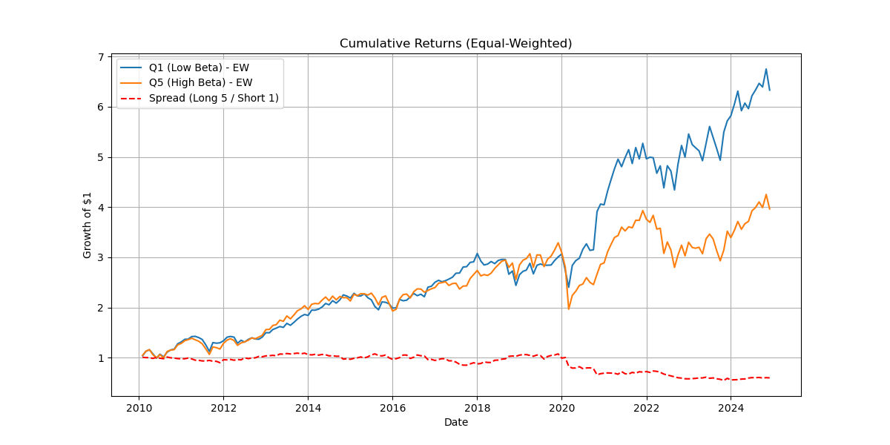

# VIX Trading Strategy Portfolio

## Overview

This project demonstrates a VIX-based trading strategy implemented in Python, focusing on beta estimation and portfolio construction. The strategy leverages the relationship between stock returns and changes in the VIX index to create a long-short portfolio.

## Key Features

- **Data Collection and Preprocessing**: Experience in handling large financial datasets, including daily stock panels and Fama-French factors.
- **Strategic Analysis**: Implementation of beta estimation using VIX changes, portfolio formation based on quintiles, and performance evaluation using FF3 model.
- **Backtesting**: Equal-weighted portfolio analysis with cumulative returns visualization and alpha calculation.

## Methodology

1. **Data Loading**: Load daily S&P 500 panel data and monthly Fama-French 3-factor data.
2. **Beta Estimation**: Calculate betas with respect to ΔVIX (VIX changes).
3. **Portfolio Construction**: Form quintile portfolios based on beta values.
4. **Performance Analysis**: Compute cumulative returns and FF3 alphas for the spread portfolio.

## Results

The analysis shows the cumulative returns for low and high beta portfolios, along with the spread (long high beta, short low beta). The FF3 regression confirms the strategy's alpha.

  <!-- Placeholder for the graph image -->

## Files

- `vix_trading_strategy.ipynb`: Jupyter notebook containing the full analysis.
- `daily_sp500_panel.parquet`: Daily stock data.
- `ff3_monthly.parquet`: Fama-French 3-factor data.
- `Group1_FP_report.pdf`: Detailed project report.

## Dependencies

- pandas
- numpy
- statsmodels
- matplotlib
- tqdm

## Usage

1. Ensure data files are in the same directory.
2. Run the Jupyter notebook to reproduce the analysis.

## Author

[Your Name] - Demonstrating expertise in quantitative finance, data processing, and strategy development.
# vix-trading-strategy
A VIX-based quantitative trading strategy portfolio demonstrating expertise in data collection, preprocessing, and strategic analysis using Python and financial data. Includes backtesting with cumulative returns visualization and FF3 alpha verification.
>>>>>>> origin/main
